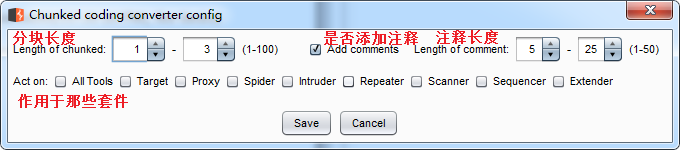

# Chunked coding converter

本插件主要用于分块传输绕WAF，不了解分块传输绕WAF的请阅读文末的文章。

## 编译

```
mvn package
```

## 插件使用




## 相关文章
* [利用分块传输吊打所有WAF](https://www.anquanke.com/post/id/169738)
* [在HTTP协议层面绕过WAF](https://www.freebuf.com/news/193659.html)
* [编写Burp分块传输插件绕WAF](https://mp.weixin.qq.com/s?__biz=Mzg3NjA4MTQ1NQ==&mid=2247483787&idx=1&sn=54c33727696f8ee6d67f997acc11ab89&chksm=cf36f9cbf84170dd7da9b48b3365fb05d7ccec6bdeff480d0c38962f712e400a40b2b38dc467&token=360242838&lang=zh_CN#rd)